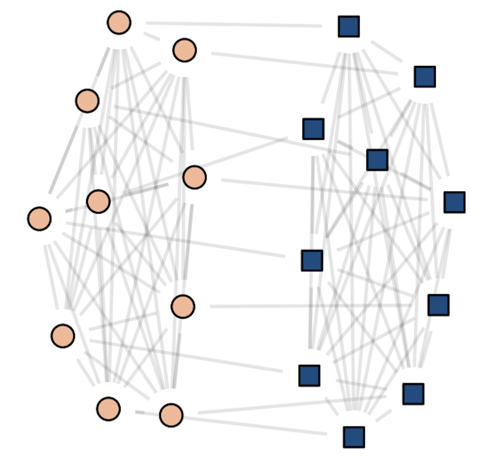

# Measuring Networks {#measurement}

*These lecture notes are based on Chapters 6 and 7 of Newman. They are a short set of highlights, and are not a substitute for actually reading these chapters! There will be content not covered in these notes that you'll need for homework problems.* 

## Networks and Matrices

Formally, an **undirected graph** $G = (N, E)$ is a set of nodes $N$ and a set of edges $E\subseteq N\times N$. Each element of $E$ is an *unordered* pair of nodes in $N$. We'll focus on the case of *simple graphs,* in which there are no multi-edges or self-loops (see Newman 6.2 for discussion of these cases).  

Matrices are fundamental tools for studying networks. Why is that? The key point is that a graph is a collection of pairwise relationships encoded by $E$, and matrices are really good for describing pairwise relationships! 

### The Adjacency Matrix {.unnumbered}

Easily the most fundamental of the matrices associated to a graph $G$ is the adjacency matrix $\mathbf{A}$, with entries

$$
a_{ij} =
\begin{cases}
    1 &\quad (i,j) \in E \\ 
    0 &\quad \mathrm{otherwise.}
\end{cases}
$$

The reason the adjacency matrix is so important is that it is a lossless representation of the graph structure -- given knowledge of $\mathbf{A}$, you can fully reconstruct the graph. Not all matrices have this property. 

#### Walks {.unnumbered}

A *walk of length $k \geq 2$* in a graph is a set of edges $(i_1,j_1), (i_2,j_2), \ldots, (i_k,j_k)$ with the property that $i_\ell = j_{\ell-1}$ for each $2 \leq \ell \leq k$. This definition doesn't work for $k = 1$; by convention, a single edge $(i,j)$ is always considered a walk of length 1. 

A question that pops up a lot in network analysis is: 

> How many walks of length $k$ exist between nodes $i$ and $j$? 

The adjacency matrix gives a concise way to address this question. First, let's consider $k = 1$. That's just the number of edges between nodes $i$ and $j$, which is exactly $a_{ij}$. Said another way, 

> The $ij$ th entry of $\mathbf{A}^1$ counts the number of walks of length $1$ between nodes $i$ and $j$. 

This turns out to generalize smoothly by induction. Let's try out this argument now. 

Suppose that $\mathbf{W}(k)$ is a matrix whose entry $w_{ij}(k)$ contains the number of walks between nodes $i$ and $j$ of length $k$. Then, $\mathbf{W}(k+1) = \mathbf{W}(k)\mathbf{A}$ has entries $w_{ij}(k+1)$ containing the number of walks of length $k+1$. 

The proof is fast: we just expand out the matrix product and interpret each term: 

$$ [\mathbf{W}(k)\mathbf{A}]_{ij} = \sum_{\ell \in N}w_{i\ell}(k)a_{\ell j}\;. \tag{cf. Newman's eq. 6.22}$$

**Exercise**: What's a *very fast* argument that this sum does indeed express the number of walks of length $k+1$ from $i$ to $j$? 

### A Linear Algebra Interlude {.unnumbered}

What kind of information does the matrix $\mathbf{A}$ hold about the graph? Well, one answer is "all of it," because $\mathbf{A}$ determines the graph up to permutations of node labels. But there's a more useful answer as well. When we as about the information contained in a matrix, we often look at the *eigenvalues* and *eigenvectors.* The eigenvalues and eigenvectors of the adjacency matrix can contain some useful information about the graph structure. Let's see an example. 

Let 

$$\mathbf{K}_n = \left[\begin{matrix}
    & 1 & 1 & \cdots & 1 \\
    1 &  & 1 & \cdots & 1 \\
    1 & 1 &  & \cdots & 1 \\
    \vdots & \vdots &\vdots &\ddots & \vdots \\ 
    1 & 1 & 1 & \cdots 
\end{matrix}\right]\;.$$

There are $n$ rows and $n$ columns. 

The is the adjacency matrix of an *n-clique*: a graph on $n$ nodes in which all nodes are connected to each other. 

Let's now consider the matrix 
$$\mathbf{A}_{2n} = \left[\begin{matrix} 
    \mathbf{K}_n & \mathbf{I}_n \\ 
    \mathbf{I}_n & \mathbf{K}_n 
\end{matrix}\right]\;.$$

Here, $\mathbf{I}_n$ is the $n\times n$ identity matrix. 

Now, $\mathbf{A}_n$ is the matrix of two cliques that have been "paired", with each node in one clique connected to exactly one node in the other clique. It looks a bit like this: 

(\#fig:unnamed-chunk-1)A visualization of the 'paired cliques' example with 20 total nodes.

What kinds of information are contained in the first few eigenvectors of $\mathbf{A}_{2n}$? 

**Exercise**: The vector of ones $\mathbf{1}_{2n}$ is an eigenvector of $\mathbf{A}_{2n}$. What is its eigenvalue? How do we know whether it is the largest one?  

**Exercise**: The vector $\mathbf{v} = (\mathbf{1}_n, - \mathbf{1}_n)$ is another eigenvector of $\mathbf{A}_{2n}$. What is its eigenvalue? 

In fact, it's true that these are the two largest eigenvalues of $\mathbf{A}$. The first one isn't very interesting, but note that the second one actually separates the two cliques! 

So, suppose we were given a graph where: 

- We knew that the graph had the paired-clique structure, but 
- We didn't know which node belonged to which clique. 

A way to solve this problem would be to compute the *second eigenvector* $\mathbf{v}$. The signs of $\mathbf{v}$ separate the two cliques. This idea is the foundation of many *spectral graph clustering* algorithms. 

In fact, the adjacency matrix isn't usually the optimal matrix to use for spectral algorithms.[@nadakuditi2012graph] This is a deep and important story related to *random matrix theory*, which has many connections to network science. 

### Degrees {.unnumbered}

The *degree* of a node is the number of edges attached to it: 

$$k_i = \left|\left\{j:(i,j) \in E\right\}\right|\;.$$

The degree is a fundamental quantity in many network analyses. Especially the *distribution of degrees* in the network can play a major role in both theory and applications. 

**Exercise**: show that the diagonal entries of $\mathbf{A}^2$ give the degree of each node. 

We often collect the degrees into a diagonal matrix $\mathbf{D}$ whose diagonal entry $d_{ii}$ contains the degree of node $i$. 

### The Laplacian {.unnumbered}

Another very important matrix for network representations is the *graph Laplacian matrix*. Actually, there are multiple matrices with claim to this name, but the one we'll usually focus on is the *combinatorial Laplacian* $\mathbf{L} = \mathbf{D} - \mathbf{A}$. 

**Exercise**: Given knowledge of the combinatorial Laplacian $\mathbf{L}$, is it possible to exactly reconstruct the graph?

The Laplacian is often used to represent *(diffusive) flows* of quantities between nodes. To see why, suppose that I have some amount of water $x_i$ on each node $i$, and that I collect this into a vector $\mathbf{x}$. Now, consider the vector $\mathbf{L}\mathbf{x}$. 

$$
\begin{align}
[\mathbf{L}\mathbf{x}]_i &= \sum_{j} \left(d_{ij}x_j - a_{ij}x_j \right) \\ 
&= \underbrace{k_ix_i}_{\text{flow out of }i} - \underbrace{\sum_{j} a_{ij}x_j}_{\text{flow into }i}\;.
\end{align}$$

The first term distributes the water $x_i$ at node $i$ to each of $i$'s $k_i$ neighbors, while the second term allows water to flow into node $i$ from each neighbor along each edge connecting them.

Modifications of this setup will become very important when we discuss random walks later in the course. 

### Many More Matrices... {.unnumbered}

There are LOTS of matrices that can be associated to networks. There's no "right" one -- some are more useful than others for certain jobs. Throughout this course, we'll see examples of matrices that are well-suited to certain specific tasks, like ranking or clustering. If you're interested in searching around a bit, some other fun matrices are: 

- The *nonbacktracking* or *Hashimoto* matrix. 
- The modularity matrix. 
- The random-walk matrix. 
- The random-walk and symmetric normalized Laplacian matrices. 
- The PageRank matrix. 
- The node-edge incidence matrix.

And the list goes on! 

### Directed and Weighted Graphs {.unnumbered}

Newman Chapter 6 contains a nice introductory discussion of directed and weighted graphs. We won't spend a lot of time on these at this stage of the course, but it's worthwhile reading this material as it may be of interest as you think about projects. 

## Measures and Metrics {.unnumbered}

### Local Measures {.unnumbered}

#### Node Importance  {.unnumbered}

- Degree
- Betweenness centrality
- Clustering coefficients 
- Degree distributions

### Global Measures {.unnumbered}

#### Network Size {.unnumbered}

- Number of nodes 
- Edge density 
- Diameter 

#### Cluster Structure {.unnumbered} 

- Cut sizes

#### Hierarchy/Planarity {.unnumbered} 

- Linearity, minimum-violation ranking

### Looking Ahead {.unnumbered}

> An important question to ask about many of these metrics is: *what counts as a large, surprising, or meaningful* value of a given metric? 

One way to address this question is to take some value and compare it to one that we believe to be small, unsurprising, or not meaningful. We often operationalize this by saying that "a random graph" would have some property, such as a low clustering coefficient. So, a high clustering coefficient is surprising, and suggests that the graph might not be "random." This motivation takes directly to the study of random graphs, which is one of the mathematical foundations of network science. 
