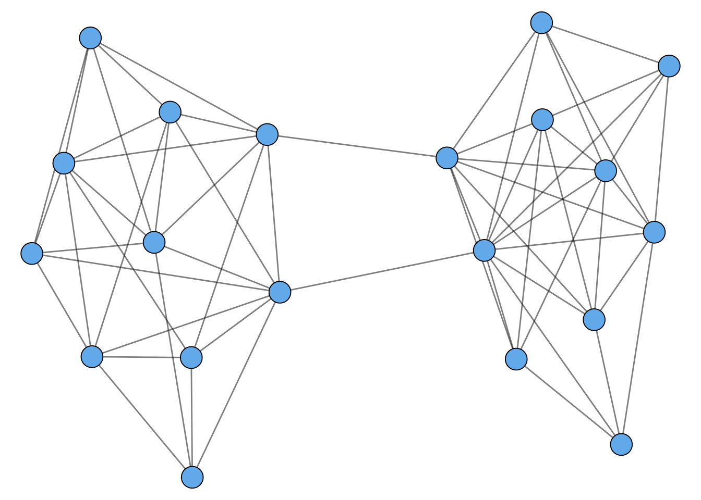

--- 
title: "MATH 168 Introduction to Networks"
author: "Phil Chodrow"
date: "2022-02-10"
site: bookdown::bookdown_site
documentclass: book
bibliography: [book.bib, packages.bib, intro-networks.bib]
# url: your book url like https://bookdown.org/yihui/bookdown
# cover-image: path to the social sharing image like images/cover.jpg
description: |
  This is the in-progress course website for MATH 168 at UCLA, as taught by Dr. Phil Chodrow in Spring of 2022. 
biblio-style: apalike
csl: chicago-fullnote-bibliography.csl
---

# Welcome! {.unnumbered}

This is the course website for MATH 168: Introduction to Networks at UCLA, as taught by Dr. Phil Chodrow, in Spring Quarter of 2022. 
Its primary purpose is to house lecture notes and other course resources.

## Network Science {.unnumbered}

What is network science? At a high level, 

> Network science is the interdisciplinary study of how systems are **connected** and what their connection structure implies about their **behavior** or **function**. 

Here's an example of a simple network. The dots represent individuals, and are called *nodes*. The lines represent connections, and are called *edges*.  

(\#fig:unnamed-chunk-1)A network with 20 nodes. This network displays one of many common properties in real-world networks, called *community structure*. In this case, the network is clustered into two densely interconnected 'communities' that are only loosely connected to each other. Community structure often accompanies phenomena such as echo chambers in online media.

Here are some of the questions that a network scientist might ask about this network: 

- What, exactly, do the **nodes** represent? Are they human agents? Are they concepts? Are they locations in physical space?
- What, exactly, do the **edges** represent? Are they persistent friendships in a social network? Are they intellectual connections between concepts? Are they transportation routes between locations? 
- Visually, it looks like this network might be roughly divisible into two interesting pieces. Is that *really* true, or is that just an artifact of how we've drawn the network? If that is really true, what kinds of **algorithms** can we use to help us find these pieces automatically?
- If we imagine a **dynamical process** unfolding on this network, such as information propagation or disease spread, how might the behavior of that process be influenced by the structure of the network?
- If we were to disrupt this network by removing a node or an edge, how might its **functionality** change? (This depends very strongly on what the nodes and edges represent.) 

### This Course {.unnumbered}

In this course, we'll study some of the primary questions we can ask about networks from a mathematical point of view. These questions include: 

- What kind of things is it useful to **measure** in networks?
- What are some **properties** shared by many real-world networks?
- What **mathematical models** are useful for understanding some of these properties? 
- What kinds of algorithms can we use to extract insights from network data? 

Along the way, we'll build our mathematical toolboxes, especially those related to linear algebra and probability. 

### Figure Code {.unnumbered}

This site includes figures, such as the one above, that I have generated with code. You can click the "View Source" button to the right to view the sourcefile for each page, including the code used to generate the figure. This code will often be in R, although I will make some effort to demonstrate some techniques with Python and NetworkX as well. 

